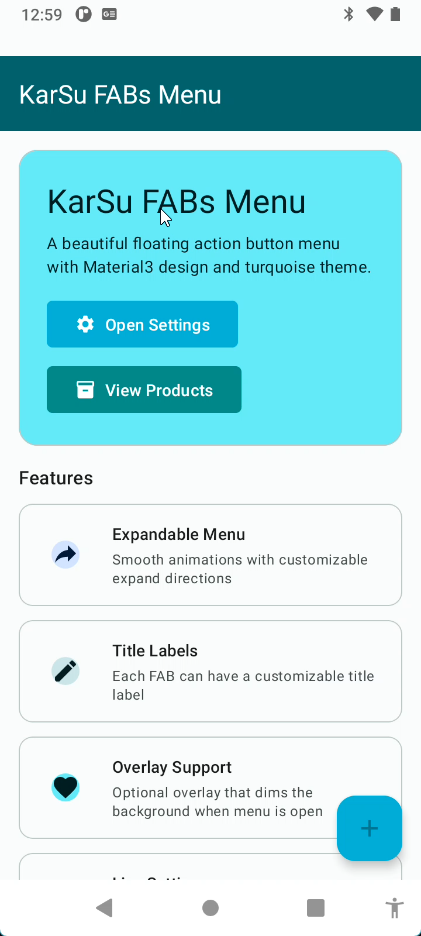
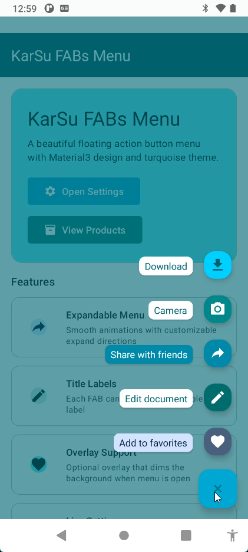
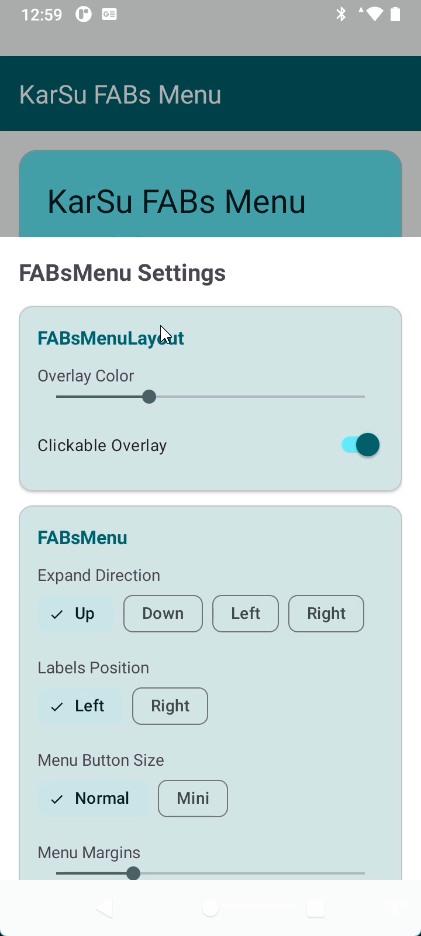
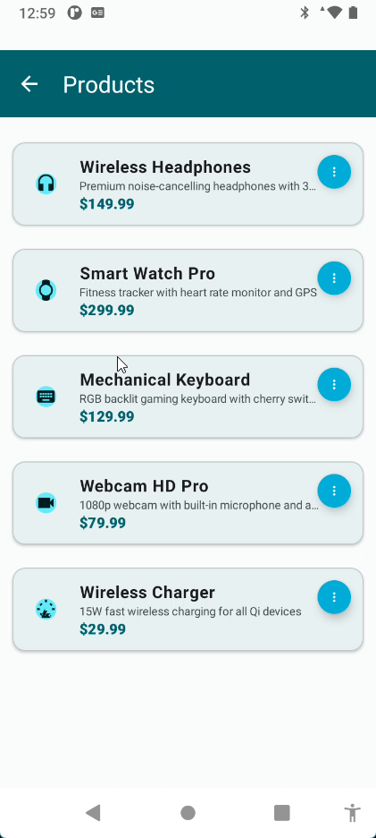
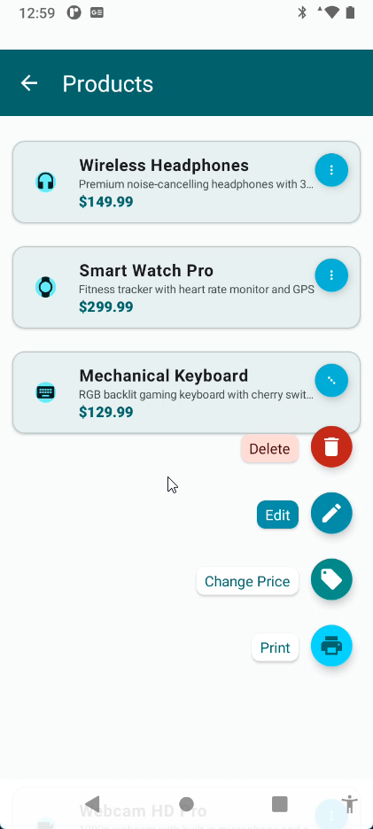
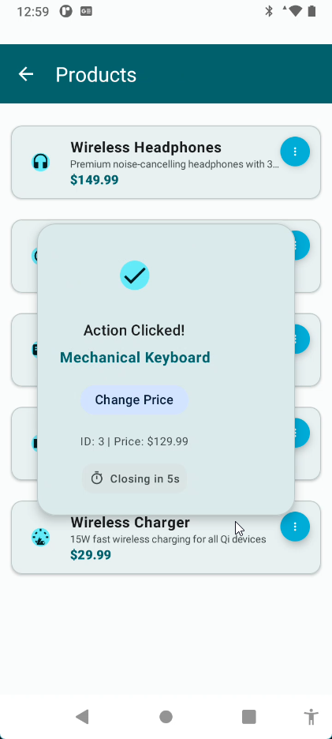

# KarSu FABs Menu

A beautiful, customizable Floating Action Button (FAB) menu library for Android with Material Design 3 support. Create expandable FAB menus with smooth animations, title labels, and overlay effects.

## Acknowledgments

This project is inspired by and rewritten based on [FABsMenu by Jahir Fiquitiva](https://github.com/jahirfiquitiva/FABsMenu). The original library provided the foundational concepts and design patterns that made this implementation possible. Thank you to Jahir Fiquitiva for the excellent work!


## Features

- **Expandable Menu** - Smooth animations with customizable expand directions (Up, Down, Left, Right)
- **Title Labels** - Each FAB can have a customizable title label with background color, text color, and corner radius
- **Overlay Support** - Optional overlay that dims the background when the menu is open
- **Live Settings** - Customize all menu properties programmatically in real-time
- **Material Design 3** - Modern design with Material You theming support
- **Mini & Normal FAB Sizes** - Support for both FAB sizes
- **Click Events** - Handle clicks on both FABs and their title labels

## Screenshots

### Main Screen
| Collapsed | Expanded | Settings |
|-----------|----------|----------|
|  |  |  |

### Product List with FAB Menu
| Products List | Menu Expanded | Action Popup |
|---------------|---------------|--------------|
|  |  |  |

### Demo Video

<video src="screenshots/scrcpy_j6ta0a6sKn.mp4" controls width="100%"></video>

## Installation

### Gradle

Add the library module to your project:

```groovy
// settings.gradle.kts
include(":pandafablibrary")

// app/build.gradle.kts
dependencies {
    implementation(project(":pandafablibrary"))
}
```

## Usage

### Basic Setup

#### 1. Add FABsMenuLayout to your layout

```xml
<karsu.libs.fabsmenu.KarSuFabsMenuLayout
    android:id="@+id/fabsMenuLayout"
    android:layout_width="match_parent"
    android:layout_height="match_parent"
    app:fabs_menu_overlayColor="#99000000"
    app:fabs_menu_clickableOverlay="true">

    <karsu.libs.fabsmenu.KarSuFabsMenu
        android:id="@+id/fabsMenu"
        android:layout_width="wrap_content"
        android:layout_height="wrap_content"
        android:layout_gravity="bottom|end"
        app:fab_menuMargins="16dp"
        app:fab_moreButtonPlusIcon="@drawable/ic_plus"
        app:fab_moreButtonBackgroundColor="@color/your_color"
        app:fab_moreButtonRippleColor="@color/your_ripple_color"
        app:fab_moreButtonSize="normal"
        app:fab_expandDirection="up"
        app:fab_labelsPosition="left">

        <karsu.libs.fabsmenu.KarsuTitleFab
            android:id="@+id/fabAction1"
            android:layout_width="wrap_content"
            android:layout_height="wrap_content"
            android:src="@drawable/ic_action"
            app:backgroundTint="@color/fab_color"
            app:fab_title="Action 1"
            app:fab_title_backgroundColor="@color/white"
            app:fab_title_textColor="@color/black"
            app:fab_title_cornerRadius="8dp"
            app:fab_enableTitleClick="true"
            app:tint="@color/icon_color" />

        <!-- Add more TitleFABs as needed -->

    </karsu.libs.fabsmenu.KarSuFabsMenu>

</karsu.libs.fabsmenu.KarSuFabsMenuLayout>
```

#### 2. Handle click events in your Activity/Fragment

```kotlin
class MainActivity : AppCompatActivity() {

    private lateinit var binding: ActivityMainBinding

    override fun onCreate(savedInstanceState: Bundle?) {
        super.onCreate(savedInstanceState)
        binding = ActivityMainBinding.inflate(layoutInflater)
        setContentView(binding.root)

        setupFabsMenu()
    }

    private fun setupFabsMenu() {
        // Set menu listener
        binding.fabsMenu.menuListener = object : FABsMenuListener() {
            override fun onMenuExpanded(fabsMenu: FABsMenu) {
                // Menu expanded
            }

            override fun onMenuCollapsed(fabsMenu: FABsMenu) {
                // Menu collapsed
            }
        }

        // Handle FAB clicks
        binding.fabAction1.setOnClickListener {
            Toast.makeText(this, "Action 1 clicked", Toast.LENGTH_SHORT).show()
            binding.fabsMenu.collapse()
        }
    }

    // Handle back press to collapse menu
    private fun setupBackPressHandler() {
        onBackPressedDispatcher.addCallback(this, object : OnBackPressedCallback(true) {
            override fun handleOnBackPressed() {
                if (binding.fabsMenu.isExpanded) {
                    binding.fabsMenu.collapse()
                } else {
                    isEnabled = false
                    onBackPressedDispatcher.onBackPressed()
                }
            }
        })
    }
}
```

## XML Attributes

### FABsMenuLayout

| Attribute | Description | Default |
|-----------|-------------|---------|
| `app:fabs_menu_overlayColor` | Overlay background color when menu is expanded | `#4D000000` |
| `app:fabs_menu_clickableOverlay` | Whether clicking overlay collapses the menu | `true` |

### FABsMenu

| Attribute | Description | Default |
|-----------|-------------|---------|
| `app:fab_moreButtonPlusIcon` | Icon drawable for the menu button | - |
| `app:fab_moreButtonBackgroundColor` | Background color of the menu button | - |
| `app:fab_moreButtonRippleColor` | Ripple color of the menu button | - |
| `app:fab_moreButtonSize` | Size of menu button (`normal`, `mini`, or `auto`) | `normal` |
| `app:fab_moreButtonCustomSize` | Custom size for the menu button in dp | - |
| `app:fab_moreButtonIconSize` | Custom icon size inside the menu button | - |
| `app:fab_moreButtonIconTint` | Tint color for the menu button icon | - |
| `app:fab_menuMargins` | Margins around the menu | `16dp` |
| `app:fab_expandDirection` | Direction to expand (`up`, `down`, `left`, `right`) | `up` |
| `app:fab_labelsPosition` | Position of labels (`left` or `right`) | `left` |
| `app:fab_animationDuration` | Animation duration in milliseconds | `500` |

### TitleFAB

| Attribute | Description | Default |
|-----------|-------------|---------|
| `app:fab_title` | Title text for the label | - |
| `app:fab_title_backgroundColor` | Background color of the label | `#FFFFFF` |
| `app:fab_title_textColor` | Text color of the label | `#000000` |
| `app:fab_title_cornerRadius` | Corner radius of the label | `4dp` |
| `app:fab_title_textPadding` | Padding inside the label | `8dp` |
| `app:fab_enableTitleClick` | Enable click on title label | `true` |

## Programmatic Customization

You can customize the menu programmatically at runtime:

```kotlin
// Change expand direction
fabsMenu.updateExpandDirection(ExpandDirection.UP)
fabsMenu.updateExpandDirection(ExpandDirection.DOWN)
fabsMenu.updateExpandDirection(ExpandDirection.LEFT)
fabsMenu.updateExpandDirection(ExpandDirection.RIGHT)

// Change labels position
fabsMenu.updateLabelsPosition(LabelsPosition.LEFT)
fabsMenu.updateLabelsPosition(LabelsPosition.RIGHT)

// Change menu button size
fabsMenu.setMenuButtonSize(FloatingActionButton.SIZE_NORMAL)
fabsMenu.setMenuButtonSize(FloatingActionButton.SIZE_MINI)

// Change margins
fabsMenu.setMenuMargins(dpToPx(16))

// Change animation duration
fabsMenu.setAnimationDuration(500)

// Update all labels at once
fabsMenu.updateAllLabelsBackgroundColor(Color.WHITE)
fabsMenu.updateAllLabelsTextColor(Color.BLACK)
fabsMenu.updateAllLabelsCornerRadius(8f)
fabsMenu.updateAllLabelsTextPadding(12)
fabsMenu.updateAllLabelsTitleClickEnabled(true)

// Overlay customization
fabsMenuLayout.setOverlayColor(Color.argb(128, 0, 0, 0))
fabsMenuLayout.setClickableOverlay(true)

// Control menu state
fabsMenu.expand()
fabsMenu.collapse()
fabsMenu.toggle()
val isExpanded = fabsMenu.isExpanded
```

## Using in RecyclerView

You can also use FABsMenu inside RecyclerView items for per-item action menus:

```xml
<!-- item_layout.xml -->
<com.google.android.material.card.MaterialCardView
    android:layout_width="match_parent"
    android:layout_height="wrap_content"
    android:clipChildren="false"
    android:clipToPadding="false">

    <androidx.constraintlayout.widget.ConstraintLayout
        android:layout_width="match_parent"
        android:layout_height="wrap_content"
        android:clipChildren="false"
        android:clipToPadding="false">

        <!-- Your content -->

        <karsu.libs.fabsmenu.KarSuFabsMenu
            android:id="@+id/fabsMenu"
            android:layout_width="wrap_content"
            android:layout_height="wrap_content"
            app:fab_moreButtonSize="mini"
            app:fab_expandDirection="left"
            app:fab_labelsPosition="left"
            app:fab_menuMargins="0dp">

            <karsu.libs.fabsmenu.KarsuTitleFab
                android:id="@+id/fabEdit"
                app:fabSize="mini"
                app:fab_title="Edit"
                ... />

        </karsu.libs.fabsmenu.KarSuFabsMenu>

    </androidx.constraintlayout.widget.ConstraintLayout>

</com.google.android.material.card.MaterialCardView>
```

**Important:** Set `clipChildren="false"` and `clipToPadding="false"` on parent views to allow the FABs to expand outside their bounds.

### Using as Badge-Style Menu Button

You can create a compact badge-style FAB menu for use in list items:

```xml
<FrameLayout
    android:layout_width="match_parent"
    android:layout_height="wrap_content"
    android:clipChildren="false"
    android:clipToPadding="false">

    <com.google.android.material.card.MaterialCardView
        android:layout_width="match_parent"
        android:layout_height="wrap_content"
        android:layout_marginTop="16dp"
        android:layout_marginHorizontal="12dp"
        app:cardCornerRadius="12dp"
        app:cardElevation="2dp">

        <!-- Card content here -->

    </com.google.android.material.card.MaterialCardView>

    <!-- FABsMenu positioned as badge -->
    <karsu.libs.fabsmenu.KarSuFabsMenu
        android:id="@+id/fabsMenu"
        android:layout_width="wrap_content"
        android:layout_height="wrap_content"
        android:layout_gravity="top|end"
        android:layout_marginTop="4dp"
        android:translationZ="10dp"
        app:fab_moreButtonSize="auto"
        app:fab_moreButtonCustomSize="32dp"
        app:fab_moreButtonIconSize="14dp"
        app:fab_moreButtonIconTint="@color/white"
        app:fab_moreButtonPlusIcon="@drawable/ic_more_vert"
        app:fab_expandDirection="down"
        app:fab_labelsPosition="left"
        app:fab_menuMargins="0dp">

        <!-- TitleFABs here -->

    </karsu.libs.fabsmenu.KarSuFabsMenu>

</FrameLayout>
```

**Key points for badge-style usage:**
- Use `FrameLayout` as root to position FAB outside CardView
- Set `translationZ` on FABsMenu to ensure it appears above the CardView
- Use `fab_moreButtonCustomSize` for precise size control
- Use `fab_moreButtonIconSize` to control the icon size inside the FAB

## Best Practices

### Memory Management

When using FABsMenu in Activities, always clear the listener in `onDestroy()` to prevent memory leaks:

```kotlin
class MainActivity : AppCompatActivity() {

    override fun onCreate(savedInstanceState: Bundle?) {
        super.onCreate(savedInstanceState)
        // Setup code...

        binding.fabsMenu.menuListener = object : FABsMenuListener() {
            override fun onMenuExpanded(fabsMenu: FABsMenu) { }
            override fun onMenuCollapsed(fabsMenu: FABsMenu) { }
        }
    }

    override fun onDestroy() {
        super.onDestroy()
        // Clear listener to prevent memory leak
        binding.fabsMenu.menuListener = null
    }
}
```

### RecyclerView Adapter Best Practices

When using FABsMenu in RecyclerView items, follow these practices to avoid memory leaks and ensure proper view recycling:

```kotlin
class ProductAdapter(
    private val onActionClick: (Product, ProductAction) -> Unit
) : ListAdapter<Product, ProductAdapter.ProductViewHolder>(ProductDiffCallback()) {

    private var expandedPosition: Int = -1

    override fun onViewRecycled(holder: ProductViewHolder) {
        super.onViewRecycled(holder)
        holder.cleanup()  // Clean up when view is recycled
    }

    inner class ProductViewHolder(
        private val binding: ItemProductBinding
    ) : RecyclerView.ViewHolder(binding.root) {

        private var currentProduct: Product? = null

        init {
            // Set up listeners ONCE in init, not in bind()
            setupListeners()
        }

        private fun setupListeners() {
            binding.fabsMenu.menuListener = object : FABsMenuListener() {
                override fun onMenuExpanded(fabsMenu: FABsMenu) {
                    val position = bindingAdapterPosition
                    if (position == RecyclerView.NO_POSITION) return
                    // Handle expansion...
                }

                override fun onMenuCollapsed(fabsMenu: FABsMenu) {
                    val position = bindingAdapterPosition
                    if (position == RecyclerView.NO_POSITION) return
                    // Handle collapse...
                }
            }

            binding.fabAction.setOnClickListener {
                // Use currentProduct instead of capturing in closure
                currentProduct?.let { product ->
                    onActionClick(product, ProductAction.EDIT)
                    binding.fabsMenu.collapse()
                }
            }
        }

        fun bind(product: Product) {
            currentProduct = product  // Update current product reference
            // Bind data...

            // Collapse menu if this item shouldn't be expanded
            if (bindingAdapterPosition != RecyclerView.NO_POSITION &&
                expandedPosition != bindingAdapterPosition &&
                binding.fabsMenu.isExpanded) {
                binding.fabsMenu.collapseImmediately()
            }
        }

        fun cleanup() {
            currentProduct = null
            if (binding.fabsMenu.isExpanded) {
                binding.fabsMenu.collapseImmediately()
            }
        }
    }
}
```

**Key points:**
- Set up listeners in `init` block, not in `bind()` method
- Use `currentProduct` variable instead of capturing product in lambda closures
- Always check `bindingAdapterPosition != RecyclerView.NO_POSITION`
- Implement `onViewRecycled()` to clean up resources
- Use `collapseImmediately()` for instant collapse without animation during recycling

## Sample App

The repository includes a sample app demonstrating:

- Basic FABsMenu usage with 5 action buttons
- Live settings panel to customize all properties in real-time
- Product list with per-item FABsMenu integration
- Action popup feedback when items are clicked

## Requirements

- **Minimum SDK:** 21 (Android 5.0 Lollipop)
- **Target SDK:** 35
- **Kotlin:** 1.9+
- **Material Components:** 1.12.0+

## Dependencies

```groovy
dependencies {
    implementation("com.google.android.material:material:1.12.0")
    implementation("androidx.core:core-ktx:1.15.0")
    implementation("androidx.appcompat:appcompat:1.7.0")
}
```

## Changelog

### Version 1.1.0
- **New Features:**
  - Added `fab_moreButtonCustomSize` attribute for precise FAB size control
  - Added `fab_moreButtonIconSize` attribute to customize icon size inside the FAB
  - Added `fab_moreButtonIconTint` attribute to tint the menu button icon
  - Added `collapseImmediately()` method for instant collapse without animation
  - Responsive FABsMenu sizing - only measures collapsed size when collapsed

- **Bug Fixes & Improvements:**
  - Fixed memory leak in `setMenuButtonIcon(Uri)` - InputStream now properly closed
  - Fixed animation listener accumulation in FABsMenuLayout
  - Improved RecyclerView support with proper view recycling
  - Added proper cleanup methods to prevent context leaks

- **Performance:**
  - Optimized `onMeasure()` to only calculate expanded size when needed
  - Reduced memory allocations in animation callbacks

## License

```
Copyright 2025 Erkan Kaplan

Licensed under the Apache License, Version 2.0 (the "License");
you may not use this file except in compliance with the License.
You may obtain a copy of the License at

    http://www.apache.org/licenses/LICENSE-2.0

Unless required by applicable law or agreed to in writing, software
distributed under the License is distributed on an "AS IS" BASIS,
WITHOUT WARRANTIES OR CONDITIONS OF ANY KIND, either express or implied.
See the License for the specific language governing permissions and
limitations under the License.
```

## Contributing

Contributions are welcome! Please feel free to submit a Pull Request.

## Author

**Erkan Kaplan**

---

If you find this library useful, please consider giving it a star on GitHub!
